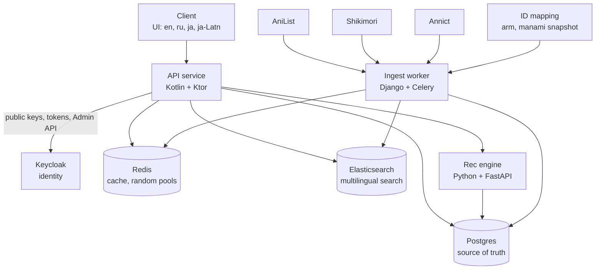

# Anime Picker

Find your next anime by chance or by taste. Anime Picker combines a filtered random picker, personal recommendations, "more like this" discovery, and advanced search over a multilingual catalog. The UI and the catalog data support English, Russian, Japanese, and romanized Japanese.

This is a hobby project. Data comes from public community APIs, so the system caches everything and never calls those APIs on a user request.

## What it does

- **Random pick.** Filter by genre, format, score, decade, and length, then reroll until something clicks. Watched titles are hidden by default.
- **For you.** A recommendation feed where every item carries a reason, such as "Because you liked *Steins;Gate*".
- **More like this.** Similar anime ranked by story, genres, tags, and studio.
- **Advanced search.** Full-text search in any script ("Атака титанов", "進撃の巨人", "shingeki"), typo tolerance, autocomplete, and faceted filters with live counts.
- **Tracking.** Watch status, 1–10 ratings, a watchlist, and "random from my watchlist".

Every user action (save, rate, skip, "not interested") feeds back into the profile, so later picks improve:

```
discover (random / recs / search) → react (save, rate, skip) → profile updates → better picks
```

## Architecture



The request path is short: the client talks only to the API service, including for sign-up and sign-in. The API creates users and gets tokens from Keycloak behind the scenes, then verifies every request's token locally with Keycloak's public keys. The API reads from Redis, Postgres, and Elasticsearch, and asks the rec engine for ranked IDs. Everything that touches external data sources happens offline in the ingest worker: Celery tasks on a nightly schedule, with a Django admin and an internal API for running and inspecting them.

## Repository layout

```
anime-picker/
├── README.md                  this file
├── docker-compose.yml         full local stack
├── .env.example               all configuration keys with safe defaults
├── infra/                     Postgres migrations, Elasticsearch index, Redis layout
│   └── README.md
├── services/
│   ├── api/                   Kotlin + Ktor public API
│   │   └── README.md
│   ├── rec-engine/            Python + FastAPI recommendations
│   │   └── README.md
│   └── ingest-worker/         Django + Celery data pipeline
│       └── README.md
└── clients/                   not started yet (Android, web, or bot)
```

## Status

| Part | State |
|---|---|
| `services/ingest-worker` | Implemented: pipeline, admin, internal API, tests. Machine translation and Testcontainers tests are still open (see its README). |
| `infra` | Postgres init, Elasticsearch image and index mapping. The Keycloak realm export is still missing. |
| `services/rec-engine` | Implemented: embeddings, ALS, hybrid ranking, filters, reasons, nightly jobs, tests. The Docker image with the real model hasn't been built yet (see its README). |
| `services/api` | In progress: foundation (config, errors, locales, `app` schema, token validation, `/meta`, health) is in. Auth, catalog, search and user features follow. |
| `clients` | Not started. |

## Services

| Service | Language | Responsibility | Writes to | Docs |
|---|---|---|---|---|
| `api` | Kotlin | Public HTTP API, locale resolution, random picks, search, user data | Postgres schema `app`, Redis user caches | [services/api](services/api/README.md) |
| `rec-engine` | Python | Embeddings, collaborative filtering, ranked recommendations | Postgres schema `rec` | [services/rec-engine](services/rec-engine/README.md) |
| `ingest-worker` | Python (Django, django-ninja, Celery) | Fetch sources, map IDs, merge, localize, index; admin site and internal run API | Postgres schemas `catalog` and `ingest`, Elasticsearch, Redis pools | [services/ingest-worker](services/ingest-worker/README.md) |
| `keycloak` | – | Accounts, passwords, sessions, JWT issuing, account emails; reached only by the API | its own `keycloak` database | [infra](infra/README.md#keycloak) |
| infra | SQL, JSON | Database roles, schemas, grants, index mapping, key layout, realm | – | [infra](infra/README.md) |

## Quick start

Requirements: Docker with Compose, about 5 GB of free RAM (Elasticsearch and Keycloak are the heaviest parts).

```bash
cp .env.example .env                  # add ANNICT_TOKEN; everything else works as is
docker compose up -d postgres elasticsearch redis keycloak   # realm is imported on first start
docker compose run --rm ingest-migrate   # catalog + ingest schemas; must run before api and rec-engine
docker compose up -d ingest-web ingest-worker ingest-beat
docker compose exec ingest-web python manage.py ingest_run --full --limit 500   # small dev catalog
docker compose run --rm rec-engine sh -c "alembic upgrade head && rec embed"
docker compose up -d rec-engine api     # each applies its own schema migrations on start
curl "http://localhost:8080/v1/anime/random?lang=ru&genre=action"   # public, no token needed
```

Drop `--limit 500` to load the whole catalog (about 20–30k titles, takes hours because of polite rate limits).

| Component | Local port | Exposed outside Docker network |
|---|---|---|
| api | 8080 | yes |
| rec-engine | 8081 | no in production, yes locally for debugging |
| postgres | 5432 | yes locally |
| elasticsearch | 9200 | yes locally |
| redis | 6379 | yes locally |
| ingest-web (admin, run API) | 8082 | locally only |
| keycloak | 8180 (8080 inside the network) | admin console only; clients never call it |

## Shared conventions

These rules apply to every service. When a service README disagrees with this section, this section wins and the service README is a bug.

### Locales

| Locale | BCP 47 tag (API, clients) | Storage key (Postgres, ES, JSON) |
|---|---|---|
| English | `en` | `en` |
| Russian | `ru` | `ru` |
| Japanese | `ja` | `ja` |
| Romanized Japanese | `ja-Latn` | `ja_latn` |

The API speaks BCP 47 tags. Storage uses the underscore key because `-` is awkward in Elasticsearch field names and SQL. Conversion happens only at the API boundary.

### Localized text fallback

Not every title has every translation. When the requested locale is missing, walk the chain left to right and use the first non-empty value. The response always says which locale was actually used.

| Requested | Title chain | Synopsis chain |
|---|---|---|
| `en` | en → ja_latn → ja | en |
| `ru` | ru → en → ja_latn → ja | ru → en |
| `ja` | ja → ja_latn → en | ja → en |
| `ja-Latn` | ja_latn → en → ja | en |

Romanized Japanese titles are filled at ingest time (curated romaji first, generated transliteration second), so `ja_latn` titles are almost never empty. There is no romanized synopsis; Japanese text is not transliterated at paragraph length.

Machine-generated text (transliteration or machine translation) is stored with `machine_translated = true` and the flag is passed to clients so they can show a small marker.

### Identifiers

- Every anime has an internal `id` (bigint). This is the only ID clients and services exchange.
- External IDs are stored alongside: `anilist_id` (required, AniList is the primary catalog), `mal_id`, `shikimori_id`, `annict_id`.
- A user's `id` is the Keycloak `sub` claim (a UUID). The app never invents user IDs.

### Scores and ratings

- Catalog `score` is 0.0–10.0 with one decimal. AniList's 0–100 average is divided by 10 during ingest.
- User ratings are integers 1–10. A missing rating is `null`, never `0`.

### Time

UTC everywhere, ISO 8601 in JSON (`2026-09-29T18:00:00Z`), `timestamptz` in Postgres.

### Errors

HTTP errors use RFC 7807 `application/problem+json` with a stable `type` slug:

```json
{
  "type": "anime-not-found",
  "title": "Anime not found",
  "status": 404,
  "detail": "No anime with id 999999"
}
```

`title` and `detail` are English and intended for logs. Clients localize by `type`.

### Service-to-service communication

- Only the API validates user tokens. Internal calls (API → rec engine) travel over the Docker network without authentication and pass the already-validated user ID.
- Services exchange IDs and codes, not display text. For example, the rec engine returns `{"code": "similar_to", "anime_id": 5114}` and the API turns it into "Because you liked …" in the user's language. This keeps all UI wording in one place.

## Data ownership

Every service owns its data outright. In Postgres that means one schema per owner inside the single `anime` database: the owner creates and migrates its schema with its own tool, and is the only one allowed to write to it. Other services get read-only access where they need it. This is enforced by database roles and grants, not only by convention.

| Postgres schema | Owner (writes, migrates) | Migration tool | Contents | Read by |
|---|---|---|---|---|
| `catalog` | ingest-worker | Django migrations | Anime, localizations, synonyms, genres, tags, studios, relations, raw source records, overrides | api, rec-engine |
| `ingest` | ingest-worker | Django migrations | Django internals, Celery schedules and results, run history | – |
| `app` | api | Flyway | `app_user`, `user_anime`, `user_feedback` | rec-engine |
| `rec` | rec-engine | Alembic | `anime_embedding`, `rec_model` | – |

Keycloak keeps its own separate `keycloak` database.

Everything else follows the same one-owner rule:

| Data | Owner |
|---|---|
| Elasticsearch `anime_v*` indices and the `anime` alias | ingest-worker |
| Redis `pool:*`, `ratelimit:source:*`, `lock:ingest:*`, and Redis DB 1 (Celery broker) | ingest-worker |
| Redis `user:*`, `cache:*`, `ratelimit:auth:*` | api |
| Credentials, sessions, roles (email, password hash, email locale) | Keycloak; the API changes them only through the Admin API |

Two cross-schema foreign keys exist: `app.user_anime.anime_id` and `rec.anime_embedding.anime_id` both reference `catalog.anime.id`. That's safe because catalog rows are never deleted, only marked `REMOVED`.

## Making changes

- **Postgres schema:** change it in the owning service with that service's migration tool (see Data ownership). Never edit a migration that has been applied.
- **Catalog schema (read by other services):** the ingest worker publishes `services/ingest-worker/contract/catalog-schema.sql`, a schema-only dump of `catalog`, and the API and rec engine run their tests against it. Adding tables or columns is always safe. Renaming or dropping something another service reads goes in three steps: add the new column, switch the readers, then drop the old one in a later change.
- **Startup order:** `ingest-migrate` runs before the API and the rec engine, because their foreign keys point into `catalog`.
- **Elasticsearch mapping:** edit `infra/elasticsearch/anime-index.json`, bump `ES_INDEX_VERSION`, then run a full reindex (`manage.py ingest_index` in the ingest worker). The alias swap makes this zero-downtime.
- **API contract:** update the Endpoints section of `services/api/README.md` in the same change.
- **Internal contract (api ↔ rec-engine):** update both service READMEs in the same change.
- **Keycloak realm:** change it in the admin console, re-export to `infra/keycloak/realm-anime-picker.json`, and commit the export.
- **External data sources:** only the ingest worker calls them. Adding a call anywhere else is a design change, not a fix.
- **New locale:** add it to the locale table above, the fallback table, the `anime_localization.locale` check constraint, the Elasticsearch mapping and analyzers, the vocabulary file in the ingest worker, the API message resources, and the Keycloak realm's supported locales and theme messages.

## Data sources and credits

Catalog data comes from [AniList](https://anilist.co), [Shikimori](https://shikimori.io), and [Annict](https://annict.com). ID cross-references come from [arm](https://github.com/kawaiioverflow/arm) and a snapshot of [manami-project/anime-offline-database](https://github.com/manami-project/anime-offline-database) (archived and read-only since July 2026). The client's About screen credits all of them.
